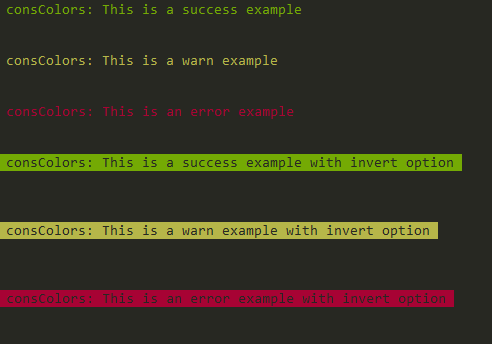

# consColors

Yet another npm package that prints colors in your console :tada:

But... the idea behind this module it's not that you can get crazy and print 1000s of different styles, this module gives you the ability to print `log`, `warn` or `error` messages to the `stdout` with a predefined message.

Have you found yourself doing something like this?

```javascript
function Animal( name ) {
  this.name = name;
  .....
}

const lion = new Animal( 'Simba' );
const cat = new Animal( 'Garfield' );
const dog = new Animal( 'Scooby-Doo' );

console.log('lion:', lion);
console.log('cat:', cat);
console.log('dog:',dog);
```
 
 The idea of this module is that by creating an instance of the logger you can omit the reference to the variable that you are trying to log the info.

```javascript
const lionLogger = consColors( 'lion' );

lionLogger.log( 'hakuna matata' ); // lion: hakuna matata
```

## How to use this package

```javascript
const consColors = require( 'consColors' );

const consColorNormal = consColors({type: 'consColors'});
const consColorInvert = consColors({type: 'consColors', invert: true});

consColorNormal.log( 'This is a success example' );
consColorNormal.warn( 'This is a warn example' );
consColorNormal.error( 'This is an error example' );

consColorInvert.log( 'This is a success example with invert option' );
consColorInvert.warn( 'This is a warn example with invert option' );
consColorInvert.error( 'This is an error example with invert option' );
```


